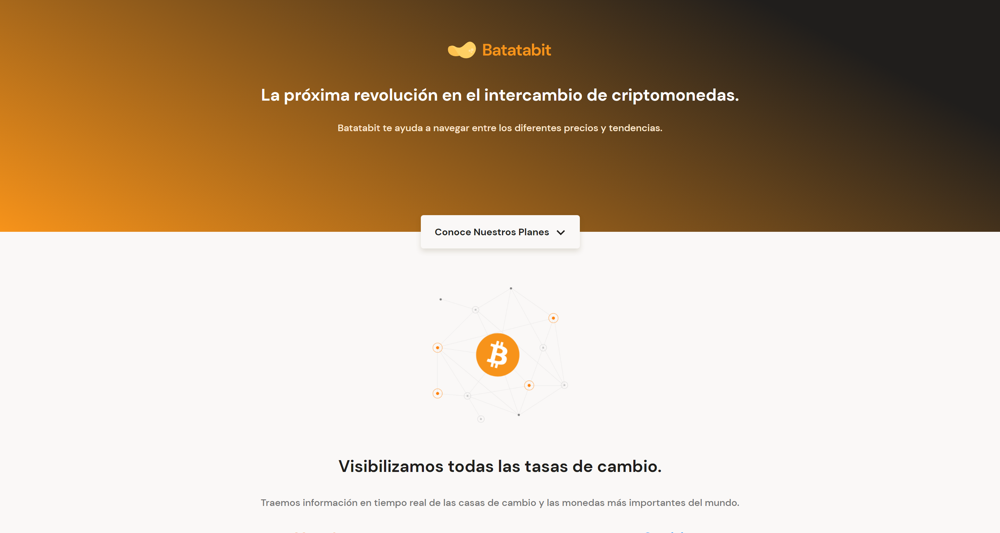

# Batata bit Landing Page

This app was built using HTML and CSS, to make the design of the Landing page implementing Mobile first design, and make the layout from Figma.

## Table of contents

- [Overview](#overview)
  - [The project](#the-project)
  - [Screenshot](#screenshot)
  - [Links](#links)
- [My process](#my-process)
  - [Built with](#built-with)
  - [What I learned](#what-i-learned)
  - [Useful resources](#useful-resources)
- [Author](#author)

## Overview

### The project

Users should be able to:

- See a Landing page on different screen sizes

### Screenshot

### Links

- Solution URL: [Solution URL here](https://github.com/ncondes/batata-bit)
- Live Site URL: [Live site URL here](https://ncondes.github.io/batata-bit/)

## My process

### Built with

- Semantic HTML5 markup
- CSS custom properties
- Flexbox
- CSS Grid
- Mobile-first workflow

### What I learned and put into practice

- Make the layout ( structure and styles ) of the app with Figma
- CSS grid
- CSS Flexbox

### Useful resources

- [CSS Flexbox](https://developer.mozilla.org/en-US/docs/Web/CSS/CSS_Flexible_Box_Layout/Basic_Concepts_of_Flexbox) - Documentation of basic concepts of flexbox

## Author

- Website - [Nicolas Conde Salazar](https://www.ncondes.com)
- Linkedin - [Nicolas Conde Salazar](https://www.linkedin.com/in/ncondes/)
